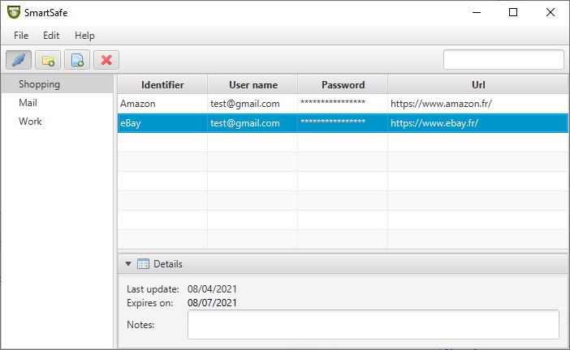
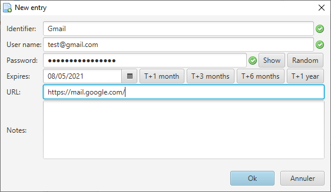

# SmartSafe Client

The SmartSafe project aims at providing a solution to securely store your passwords.
This password manager is split in several repositories: see the corresponding repository to have a complete description of each one.

The SmartSafe Client part consists in a rich application that allows a user to manage the Java Card smart card (for instance loading the Server application) and to use the password manager (create new entries, view entries, change the password, etc.).





## Security assumptions
The main security relies on the Java Card smart card that stores the sensitive data. The SmartSafe is assumed to be run on a trusted environment. Therefore attacks on the client implementation are not considered as relevant.

## Quick start

You need to have a Java Card Development Kit and Maven installed in order to build the project using the following command:

```
mvn clean compile assembly:single
```

The obtained JAR file can be executed by the following command:

```
java -jar SmartSafeClient-X.Y.Z-jar-with-dependencies.jar
```

## Hardware set-up

Two main hardware components are required, a Java Card smart card and a card reader.

Smart cards can be found in different form factors. As the final product is intended to be relatively small, SIM format is the best choice. Indeed, various USB card reader taking SIM cards exist. Such readers are very similar in size to a standard USB flash storage.

Concerning the Java Card smart card, currently supported versions are 3.0.x only: so be careful when choosing the smart card.

The reader must be adapted to the chosen smart card format (for instance SIM format): be careful again when choosing it.

---
**NOTE**

An Android App implementing the SmartSafe client side is intended to be developed.

This application will use the Bluetooth interface in order to communicate with the smart card. Indeed, some readers offer the ability to communicate with the smart card through the USB port and through a Bluetooth interface.

---

## Known issues

When running on Windows 10, the console may display this error (WARNING: Could not open/create prefs root node Software\JavaSoft\Prefs at root) and/or you may experience that the preference settings are not saved. In this case, the solution is to manually create the following registry key (by using regedit) : HKEY_LOCAL_MACHINE\Software\JavaSoft\Prefs

## Road map
The following features are already developed:

 - Ability to connect to a card and perform user operations (password update, reading and writing groups and entries, etc.)
 - Ability to set preferences (language, default settings, etc)
 - Ability to perform card content management
 - Search engine in the rich interface
 - Secure messaging between the Client and the Server in order to avoid Man-in-the-middle and replay attacks
 - Ability to retrieve information about memory usage in the smart card and other useful stats
 - Adding help content in the rich interface

The following features are intended to be developed:

 - Editing Group name and other stuff
 - Synchronization between two tokens
 - Stream cipher
 - Windows login application